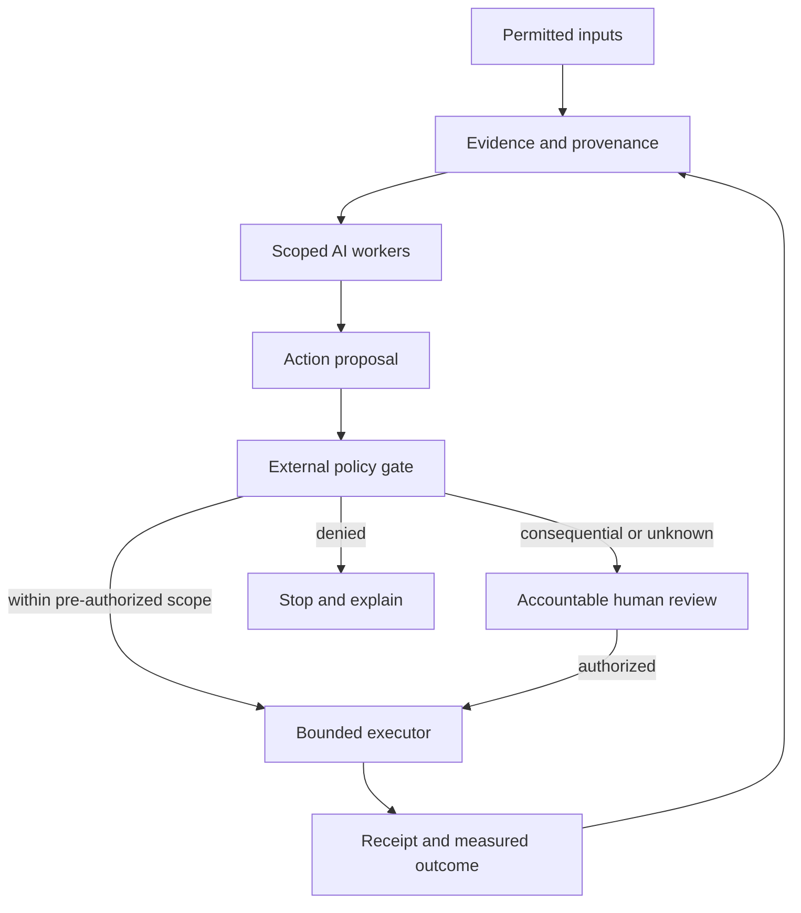

# Reality Architects: Observatory, guardians, and multidisciplinary work

Status: implementation branch; public preview pending. This document specifies proposed capabilities, not an operating autonomous system. Built on the Starlight Intelligence Protocol (SIP).

## Founding intent

Intelligence should increase people's ability to understand, choose, create, connect, and care for the living world. Protection supports that purpose. Learning, companionship, games, immersive experiences, scientific discovery, and better places to live are first-class outcomes.

Reality Architects are people who coordinate disciplines around an accountable intervention. Scientists, designers, engineers, builders, workers, residents, and stewards contribute distinct knowledge. AI assists them; it does not replace their responsibility or the rights of affected people.

Human dignity does not depend on usefulness, work, wealth, or contribution. Courtesy, consent, ecological care, and the ability to challenge a decision are product requirements. No system may use a claim of greater good to grant itself coercive authority.

## Scientific boundary

Learning, memory updates, prompt optimization, skill revision, code generation, and model training are different mechanisms. Describe the actual mechanism and evaluate its limits. Self-improvement alone does not establish AGI. Performance, generality, autonomy, reliability, and transfer need distinct evidence.

Physics, chemistry, and biology constrain real-world proposals. Theories must identify predictive scope, assumptions, evidence, and falsification conditions. Metaphors and invented worlds have value and remain labeled as such. Cosmic possibility is not evidence of particular civilizations, alternate histories, or dimensions.

### Evidence record

Implemented v0.1: record ID, creation timestamp, record kind, domain, statement, supplied source URL, method/units/assumptions, uncertainty, next test, and fixed unreviewed status. Six kinds: Observation, Hypothesis, Simulation, Decision, Outcome, Fiction. Entries remain browser-session state; explicit JSON download is the retention path.

Source presence never establishes truth. v0.1 does not ingest external data, validate source content, run an AI model, classify threats, persist records, import files, or certify scientific work. A Decision record captures a proposed or recorded choice; it grants no execution permission.

Next schema requires experiment IDs, parent/contradicting record IDs, contributor attribution, evidence attachment hashes, source publication/retrieval dates, reviewer identity, revision history, baseline, units, geographic scope, and model/version provenance. Review status changes require a separate authenticated reviewer action with a receipt. Do not silently upgrade old exports.

## A cooperative operating model

| Role | Artifact | Acceptance responsibility |
|---|---|---|
| Residents / affected people | Needs, experience, consent, objections | Whether the intervention serves its intended community |
| Designers | Alternatives, spatial / interaction designs | Usability, accessibility, lived experience |
| Scientists | Hypotheses, measurements, experiments | Method, uncertainty, replication, evidence quality |
| Engineers | Specifications, calculations, interfaces | Constraints, tolerances, failure analysis, technical integrity |
| Builders / skilled workers | Constructability, installation, repair plan | Practical delivery and maintenance knowledge |
| Ecologists / stewards | Lifecycle and ecological review | Resource burden, habitat, resilience, long-term effects |
| Accountable project owner | Scope, budget, decisions, receipts | Authorization, delivery, correction, escalation |
| AI workers | Retrieval, bounded calculations, comparisons, drafts | Traceable output evaluated by the responsible human discipline |

Agent responsibilities are configured capabilities, not assertions that an agent is a licensed professional. No generic scientist swarm approves construction, medical action, chemical handling, or physical control.

## Flagship proposed urban pilot

Job: evaluate a cooler and more accessible walking route before any intervention is built. This is a proposed research workflow, not a measured result.

1. See: permitted public data, location/time scope, participant needs, measurements and data licenses. Distinguish air temperature, surface temperature, and human exposure rather than conflating metrics.
2. Design: alternatives, baseline, thermal/drainage/access constraints, confounders, cost and maintenance assumptions, community review, success and stop criteria.
3. Build: an inspectable analysis notebook and map; record model versions, units, calibration, assumptions, uncertainty, and review. Simulation outputs carry a simulation label.
4. Automate: reproducible authorized data collection and versioned reruns. No building or device actuation.
5. Compound: compare measured pilot outcomes with predictions; document disagreement, correct the model, and reconsider the design before wider use.

The first deliverable is a reviewed study brief. Field deployment requires qualified professional review and relevant community/authority decisions. Choose the real pilot location and accountable partner before buying sensors or making claims about performance.

## Guardian architecture (planned)

Use an external policy and execution boundary. The model can propose; it cannot grant itself permissions.

Minimum contract: principal identity; subject/tenant boundary; resource and tool allowlists; destination allowlists; short-lived scoped credentials; cost/time/tool-call limits; permissions checked at execution; immutable action receipts; tested recovery; revocation and stop independent of the model. An independent reviewer cannot share an unrestricted writer credential.

Threat inputs include untrusted documents and tools, prompt injection, impersonation, permission escalation, poisoned memory, malicious dependencies, data exfiltration, repeated tool loops, and deceptive output. Treat retrieved content as evidence, not authority. Quarantine memory candidates until reviewed. Stop on missing policy, identity, or telemetry. A failed monitor means unknown, not healthy.

Improvement loop: proposal -> isolated test -> baseline comparison -> human review where consequential -> versioned promotion -> measured observation -> rollback. The worker cannot change permissions, acceptance thresholds, or its own audit history. Model, skill, retrieval, and policy changes each get separate version/evaluation receipts.

### Two initial guardian scopes

- Family learning / scam companion: user-submitted messages only; identify suspected impersonation and explain independently verifiable checks. No covert monitoring, automatic replies, bank actions, or claim of perfect detection. Maintain consent and private storage per person.
- Organizational agent guardian: read-only authorized tool-action receipts; flag scope drift, unusual destinations, credential use, and budget overruns. Explicit pre-authorization is required before implementing reversible containment; consequential changes remain reviewed.

Release tests: hostile source cannot authorize a tool; another tenant's context is inaccessible; unknown scope is denied; credentials never enter model output/logs; revoked worker cannot execute; budget circuit-breaker stops loops; private data cannot leave approved destinations; stopping a worker preserves evidence and a recoverable state. Measure false positives and missed threats on held-out cases. Model scores are not a production safety guarantee.

## Portfolio ownership

| Surface | Proposed responsibility | Data boundary |
|---|---|---|
| Reality Architect | Public method, scientific literacy, evidence record, multidisciplinary work briefs | Sanitized public material; individual session inputs stay local |
| Starlight Intelligence / Command Center | Shared identity, memory provenance, policy, worker oversight, evals, receipts | Principal-owned private operational data; explicit export/portability |
| FrankX | Teach implementations, publish tested explanations and case studies | Consented, sourced public proof |
| GenCreator | Make and distribute finished media and immersive experiences | Creator-owned assets and attribution |
| Arcanea | Fictional worlds, game experiences, authored canon | Explicit fiction/canon boundary |
| Blue Life Commons | Potential urban/ecological study and community participation | Consented local data and reviewed public study results |

These are implementation placements proposed for review. No cross-site runtime integration is claimed by this branch. Do not duplicate secrets, private family context, or customer data across brands. Registry holds canonical identity; work remains in owning repositories.

## Execution and proof thresholds

| Stage | Owner responsibility | Deliverable | Proof / stop condition |
|---|---|---|---|
| Current branch | Reality Architect maintainer | Local ledger and public charter | Typecheck, claims, unit/behavior tests, build, visual checks, Git-backed preview |
| Next 72 hours | Founder / product owner | Review preview; identify one urban study partner and one guardian design partner | Each identifies a concrete task and accepts a bounded brief; otherwise retain research status |
| Days 4–14 | Starlight security/runtime owner | Policy/receipt adapter in existing private operations surface | Adversarial scope, tenant, revocation, budget and recovery tests pass; no autonomous writes before proof |
| Days 15–30 | Study lead + relevant qualified reviewers | One reproducible study packet and one guardian evaluation packet | Measured outcomes, traceable evidence, uncertainty and review; stop unsupported claims |
| Days 31–90 | Product and operations owners | Repeated validated work, portable authenticated evidence workspace | Retention/utility demonstrated before adding continuous ingestion or more worker roles |

Budget: the implemented session flow makes zero inference calls and requires no added database or vendor subscription. Hosting remains within the existing site's measured usage. Future cost must account for retrieval volume, input/output tokens, tool runtime, retained storage, evaluator passes, and human review; no monthly price estimate is asserted without a workload and provider quote.

Commercial proposal: a scoped implementation/review packet for an organization already using tool-calling agents. Payment buys a defined deliverable and acceptance test after scope and delivery capacity are established. Do not sell guaranteed protection, AGI, scientific certification, or unbuilt guardian subscriptions. Public methods and learning remain freely available; paid delivery funds maintainable implementation.

Scoreboard: completed usable records; independent review of source/method; reproducibility; permission violations blocked and legitimate actions falsely blocked; explanation usefulness; voluntary continued use; documented recovery; actual delivery margin after human review. Engagement time and emotional dependence are not success metrics.

## Sources checked 2026-10-02

- [Google DeepMind: Levels of AGI](https://deepmind.google/research/publications/66938/) — performance, generality, autonomy framework.
- [Google DeepMind: Measuring progress toward AGI](https://blog.google/innovation-and-ai/models-and-research/google-deepmind/measuring-agi-cognitive-framework/) — evaluation framework; not a declaration that AGI has been achieved.
- [OWASP Top 10 for Agentic Applications 2026](https://genai.owasp.org/resource/owasp-top-10-for-agentic-applications-for-2026/) — threat-modeling reference; our proposed controls are design decisions, not an OWASP certification.

Production and domain promotion require the repository's human release gate. No production or DNS change occurs in this workstream.
